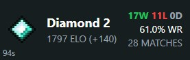
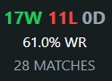
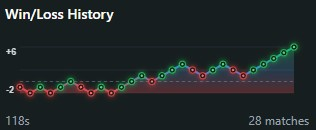
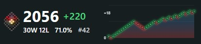
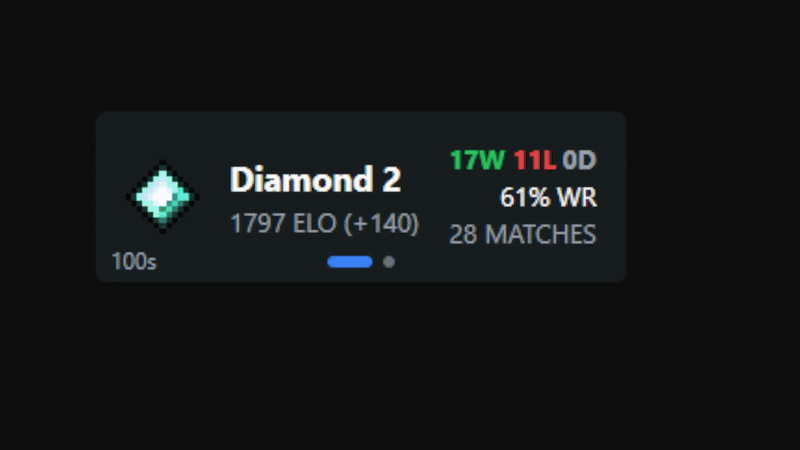

# MCSR Ranked Widget

> **Project Status:** ✅ Active - This project has been revived and is actively maintained!

A modern, customizable widget for [OBS](https://obsproject.com/) that displays real-time player statistics from [MCSR Ranked](https://mcsrranked.com/). Track your rank, ELO, match history, and performance metrics with a fully customizable drag-and-drop interface.








## Features

- **Real-time Stats** - ELO rating, rank, wins/losses/draws, win rate, and more
- **Fully Customizable** - Drag-and-drop interface with custom colors and positioning
- **Snap-to-Grid** - Hold Shift while dragging for precise alignment
- **Average Completion Time** - Track your average speedrun time from won matches
- **Player Avatars** - Display Minecraft player heads using mc-heads.net API
- **Auto-Updates** - Statistics refresh every 2 minutes automatically
- **Responsive Sizing** - Customize widget dimensions to fit your stream layout

## Quick Start

1. Visit the [Widget Generator Page](https://mcsrr-widget.cltw.dev)
2. Enter your MCSR Ranked username
3. Choose your widget type:
  - **Default** - Classic layout with all stats
  - **Small Box** - Compact version for minimal overlays
  - **Custom** - Fully customizable drag-and-drop layout
  - **Graph** - Graph widget showing historical win/loss/elo trends
  - **Carousel** - Multiple widgets with auto-rotating transitions
4. Configure your settings (timestamp, colors, positioning)
5. Click **Generate Widget** and copy the URL
6. Add as a **Browser Source** in OBS with the generated URL

**Recommended dimensions:** 300px × 100px (Default/Small), 320px × 136px (Graph), 320px × 176px (Carousel)

## Custom Widget Features

The custom widget type offers advanced customization:

- **Drag & Drop** - Position elements anywhere on the canvas
- **Color Customization** - Click any text element to change its color
- **Grid Snapping** - Hold Shift while dragging for 10px grid alignment
- **Element Library** - Choose from 12+ available features:
  - Rank Icon & Player Head
  - Player Rank & ELO Rating
  - ELO Change (+/-)
  - Wins, Losses, Draws
  - Win Rate %
  - Total Matches
  - Average Completion Time
  - Countdown Timer

## Carousel Widget Features

Display multiple widgets with smooth auto-rotating transitions:

- **Multi-Widget Support** - Combine Default, Small Box, and Graph widgets
- **Configurable Duration** - Set transition time from 3-15 seconds
- **Smooth Transitions** - 300ms fade animation between widgets
- **Progress Indicator** - Animated dots showing current widget (toggleable)
- **Shared Timer** - Single countdown timer synced across all widgets
- **Smart Positioning** - Automatically adjusts for different widget sizes


### Widget Endpoints


- `/widget/now?player=USERNAME` - Track stats from current time forward
- `/widget/[timestamp]?player=USERNAME` - Track stats from specific date/time
  - Example: `/widget/2024-01-01T00:00:00Z?player=7rowl`

### Query Parameters

- `player` - **(required)** MCSR Ranked username
- `widgetType` - Widget style: `1` (default), `2` (small), `3` (custom), `4` (graph), `5` (carousel)
- `layout` - Custom widget layout configuration (JSON)
- `width` - Custom widget width in pixels (100-800)
- `height` - Custom widget height in pixels (50-400)
- `carouselWidgets` - Comma-separated widget types for carousel (e.g., `1,2,4`)
- `transitionDuration` - Seconds between transitions (3-15, default: 5)
- `showProgressIndicator` - Show/hide progress dots (`true`/`false`)
- `opacity` - Widget opacity (0-100)
- `bgColor` - Background color (hex or `transparent`)
- `showTimer` - Show/hide countdown timer (`true`/`false`)
- `fontFamily` - Font family for text elements

- `font` - Optional CSS font-family string to override the default font for text elements (example: `Inter, Arial, sans-serif`). If `layout` JSON includes per-element `font` fields, those take precedence over this global `font`.


### Layout Configuration JSON example

```json
[
  {
    "id": "playerRank",
    "label": "Player Rank",
    "x": 21,
    "y": 17.5,
    "width": 100,
    "height": 24,
    "type": "text",
    "color": "#FFFFFF",
    "scale": 1
  },
  {
    "id": "elo",
    "label": "ELO Rating",
    "x": 170,
    "y": 50.5,
    "width": 80,
    "height": 20,
    "type": "text",
    "color": "#FFFFFF",
    "scale": 1
  }
  ...
]
```

## Development

```bash
npm install
npm run dev
npm run build
npm start
```

Built with [Next.js 14](https://nextjs.org/) and [Tailwind CSS](https://tailwindcss.com/)

## Roadmap

### Current Features
- ✅ Core widget functionality
- ✅ Real-time stat tracking
- ✅ Multiple widget types (Default, Small, Custom, Graph, Carousel)
- ✅ Drag-and-drop custom widget editor (need improvements :D)
- ✅ Background color and opacity customization
- ✅ Font family selection
- ✅ Timer toggle option
- ✅ Historical data from custom timestamps
- ✅ Carousel with multiple widgets and auto-transitions
- ✅ Show/hide elements based on conditions (like elso +/- color change)
- ✅ Templates for custom widgets (pre-made layouts)
- ✅ New widget type: Stats + Graph combined

### Planned Features
- UI/UX improvements for the generator interface
- Additional graph types and visualizations
- More widget themes and presets
- Mobile-responsive widget editor
- Add more conditional formatting options
- Add more templates for custom widgets

Have a feature request? [Open an issue](https://github.com/cltWilly/mcsrr-widget/issues)!

## Streamers Using This Widget

These awesome streamers are using the MCSR Ranked Widget on their streams:

<!-- Add your name here if you're using this widget! Submit a PR or open an issue -->
- *Ups, currently no streamers listed!*

Using this widget on your stream? I'd love to feature you! Just open an issue or submit a pull request with your channel name and link.

## Contributing

Contributions are welcome! Feel free to open issues or submit pull requests.

## License
This project is open source. If you use or fork this code, please provide credit to the original project.

---

**Note:** This widget is not officially affiliated with MCSR Ranked.
